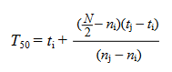

```{r, include = FALSE}
knitr::opts_chunk$set(
  collapse = TRUE,
  comment = "#>"
)
```

```{r setup}
library(seedTools)
```

Germination T~50~ is the time at which 50% of the viable seeds in an experiment have germinated. One approach to calculate T~50~ values is to use Coolbear et al. (1984) formula modified by Farooq et al.(2005).



where N is the final number of germinating seeds and n~j~ and n~i~ are the cumulative number of seeds germinated by adjacent counts at times t~j~ and t~i~ , respectively, when n~i~ < N/2 < n~j~.
In essence, this formula identifies the midpoint of the cumulative germination sigmoidal curve, where the slope is steepest.

`coolbear()` requires a vector of cumulative germination, a vector of the dates or times at which these germinations were recorded, and the total number of viable seeds in the experiment.

```{r}
total_viable_seeds<-25
time_germination_recorded<-c(seq(1,12,1)) #germination scored daily for 12 days
cumulative_germination<-c(0,0,0,0,1,3,6,7,15,16,23,25)

coolbear(time_germination_recorded,cumulative_germination,total_viable_seeds)
```
If T~50~ can't be calculated (e.g. not enough seeds germinated) the function will output NA.
'coolbear()' can efficiently be used within a loop to calculate T~50~ of several experiments at a time. Given the following germination experiment results (including a row with final viability):

```{r}
germination_results<-data.frame(days=c(seq(1,12,1)),
                                exp1=c(0,0,0,0,0,0,0,9,9,9,9,9),
                                exp2=c(0,2,5,6,7,12,16,25,25,25,25,25),
                                exp3=c(0,0,0,10,15,20,25,26,27,28,28,30))

germination_results
```

`coolbear()` can easily be implemented like:

```{r}
for (col in colnames(germination_results)[-1]) {
  
  T50<-coolbear(day=germination_results$days,
           cumulative=germination_results[[col]],
           n=25)
  
  print(paste(col,"- T50:", T50))
}
```
Note the function has been feed with a fixed number of viable seeds, but this can be modified to be a vector to adapt for different viabilities across experiments and replicates

