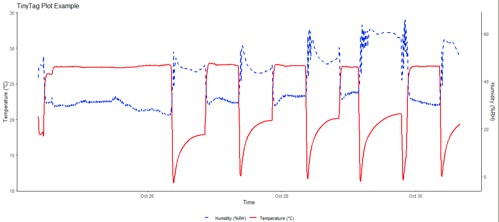

# Using `tinyTag_plot()`

Data recorded with **Gemini TinyTag** loggers can be downloaded using the *TinyTag Explorer* software. The `tinyTag_plot()` function in **seedTools** provides a simple way to clean the exported `.csv` file and generate a dual-axis plot showing recorded **temperature** and **humidity** over time.

To use this function, supply the path to the `.csv` file and, optionally, a custom title for the plot. For example:

`tinyTag_plot("example_file.csv", title = "TinyTag Plot Example")`

